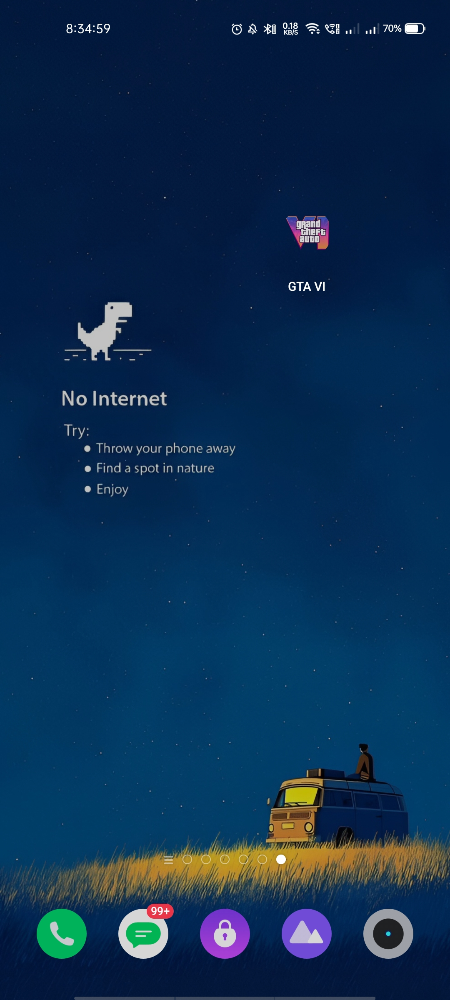
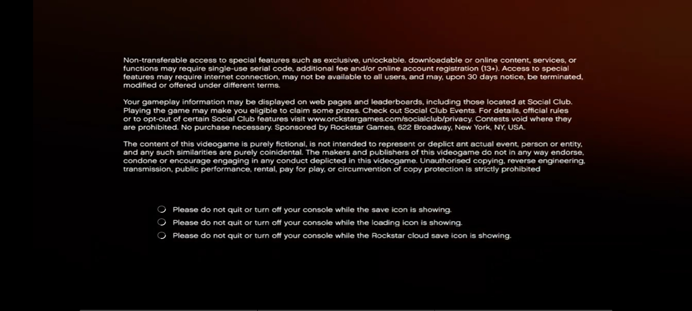
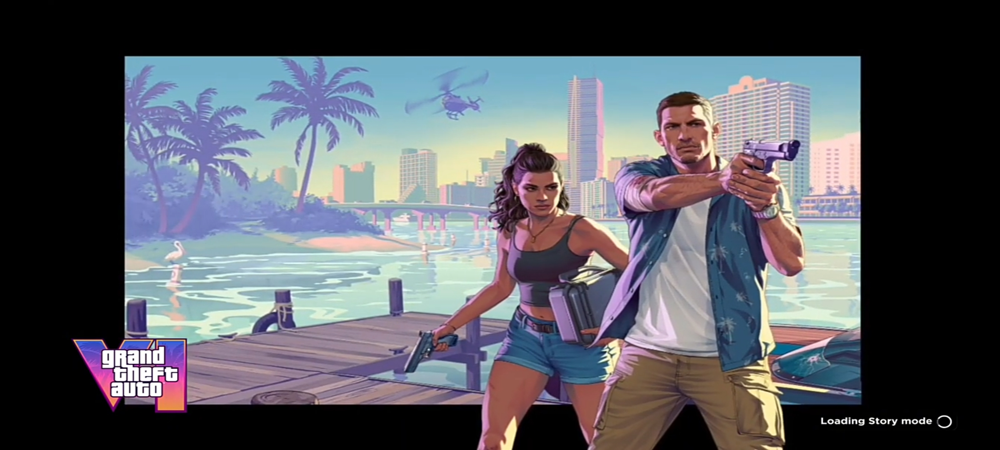

# GTA VI Android - High Performance Mobile Concept 🎮

[](https://developer.android.com)
[](https://gradle.org)
[](LICENSE)

> **⚠️ DISCLAIMER: PRANK APP**
> This application is a **PRANK**. It is designed to simulate a high-end "GTA VI" loading sequence on mobile devices, followed by a realistic simulated "system crash." It does **NOT** contain any actual game files or executable game code.

---

## 🌟 Overview

**GTA VI Mobile Concept** is an immersive Android application that showcases what a next-gen loading sequence could look like on mobile hardware. It features a full-screen, landscape cinematic experience, followed by a simulated "Fatal Error" sequence common in high-performance PC gaming.

### 🚀 Features
*   **Cinematic Intro**: Plays a high-definition `GTAVI.mp4` intro video directly from assets.
*   **Landscape Immersive UI**: Forced orientation for a console-like feel.
*   **Edge-to-Edge Experience**: Uses `WindowInsetsControllerCompat` to hide system bars.
*   **Simulated Crash System**: A randomized error generator that mimics GPU, VRAM, and memory failures.
*   **Safe Exit**: Gracefully terminates the process after the "crash" sequence.

---

## 📸 Screenshots (Horizontal View)

| App Home Screen | Cinematic Loading | Loading Screen Concept |
|:---:|:---:|:---:|
|  |  |  |

---

## 📂 Project Structure

```text
GTAVI/
├── app/
│   ├── src/
│   │   ├── main/
│   │   │   ├── assets/
│   │   │   │   └── GTAVI.mp4          # The intro cinematic video
│   │   │   ├── java/com/mario/gtavi/
│   │   │   │   └── MainActivity.kt    # Core logic (Video playback & Crash UI)
│   │   │   ├── res/
│   │   │   │   ├── layout/            # UI Layouts (VideoView container)
│   │   │   │   └── values/            # App themes and styles
│   │   │   └── AndroidManifest.xml    # Permissions and Orientation config
│   └── build.gradle.kts               # Dependencies (Compose/Material 3)
└── README.md                          # Documentation
```

---

## 🛠️ Technical Details

*   **Min SDK**: 29 (Android 10)
*   **Target SDK**: 37 (Android 15)
*   **Compile SDK**: 37
*   **Language**: Kotlin
*   **API Highlights**: 
    *   `MediaPlayer` for hardware-accelerated video.
    *   `AlertDialog` for system-style error prompts.
    *   `SurfaceHolder` for direct video rendering.

---

## 🔍 SEO & Keywords

**Keywords**: *GTA VI Mobile, Grand Theft Auto VI Android, GTA 6 Mobile Concept, Android Prank App, GTA VI Loading Screen, GTA 6 Graphics Test, Mobile Game Prank, GTA VI Beta Android, Rockstar Games Concept, GPU Stress Test Simulation.*

**Description**: Experience the most realistic GTA VI Android concept app. Featuring high-end cinematic loading screens and a simulated crash sequence. Perfect for pranking friends with a "Fatal Error" simulator on mobile.

---

## ⚖️ License

This project is for educational and entertainment purposes only. "Grand Theft Auto" and "GTA" are trademarks of Rockstar Games. This project is not affiliated with or endorsed by Rockstar Games or Take-Two Interactive.
